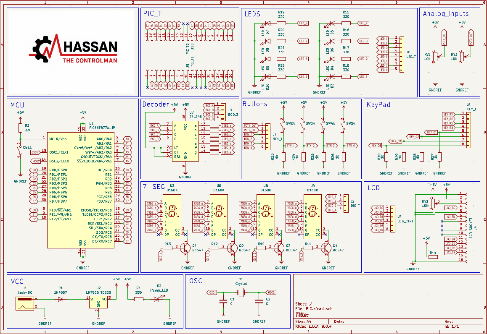

# EduBoard PIC16 - Trainer Kit

An educational, single-layer development board designed to simplify learning and prototyping with the Microchip PIC16F877A microcontroller. Designed entirely in KiCad, this board eliminates complexity and focuses on a modular, jumper-based routing architecture for students and electronics enthusiasts.

## 🔗 Live Interactive Preview
    
🌐 **[Click Here to View Live-Demo_&_Interactive_BOM & Project Website](https://hassan-ibn-mustafa.github.io/NanoCore_328/)**

*Click the badge above to explore the live interactive web deployment and view the full layout directly in your browser!*

## 🗺️ Circuit Schematic

Here is the complete schematic diagram of the EduBoard PIC16. For a high-resolution scalable version, please check the `Docs/` directory.

  

## 📸 3D Hardware Showcase

  
  

## 📁 Repository Structure

The repository is organized to provide easy access to documentation, source files, and manufacturing data:

* **`Docs/`**: Contains easy-to-read PDF files for quick reference without needing CAD software.
  * `Schematic.pdf`
  * `Layout_Top.pdf`
  * `Layout_Bottom.pdf`
* **`Fabrication/`**: Contains the `.zip` file with standard Gerber and Drill files. This zip file is production-ready and can be directly uploaded to any PCB manufacturer (e.g., JLCPCB, PCBWay).
* **`images/`**: Contains 3D renders and physical photos of the board.

## ⚙️ Technical Specifications

* **Microcontroller:** Microchip PIC16F877A
* **PCB Details:** Single-Layer DIY-friendly design
* **EDA Tool:** KiCad
* **Display Peripherals:** 16x2 Character LCD & 4-digit 7-segment display (multiplexed via 74LS48).
* **Power Subsystem:** LM7805 voltage regulation via DC barrel jack.
* **Routing:** 100% jumper-wire configuration using precision female headers for maximum experimental flexibility.

## 🛠️ Fabrication & Manufacturing

To manufacture this board:
1. Navigate to the `Fabrication/` directory.
2. Download the provided `.zip` file.
3. Upload the `.zip` file directly to your preferred PCB manufacturer. No further CAM processing is required.

---
*Designed & Developed by **Hassan Mustafa Hashem** - Industrial Electronics & Control Engineering.*
